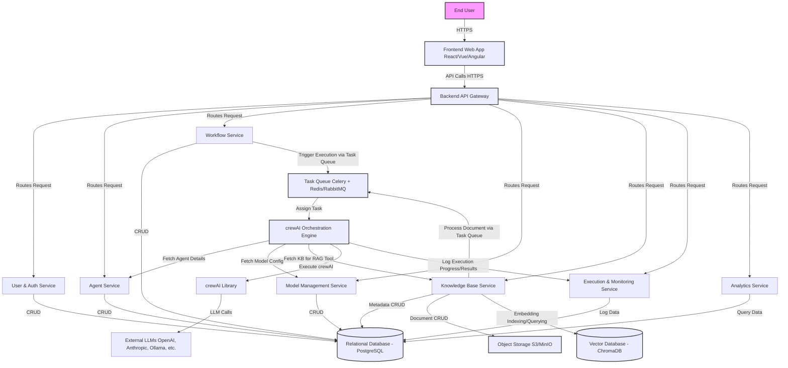

## High-Level Design (HLD)

The HLD outlines the overall architecture, technology stack, data flows, and key strategies for the AI Agent & Workflow Management Platform.

---

### I. System Architecture

The system will be designed as a modular, microservices-based architecture to ensure scalability, maintainability, and independent development of components.

**Key Components/Modules:**

1.  **Frontend Web App:** The user interface (UI) enabling users to interact with the platform.
2.  **Backend API Gateway:** A single entry point for all client requests, routing them to the appropriate backend services. Manages authentication and rate limiting.
3.  **User & Auth Service:** Manages user accounts, authentication (e.g., JWT), and authorization (RBAC).
4.  **Agent Service:** Handles CRUD operations for AI agent definitions, their configurations, and associations with knowledge bases.
5.  **Workflow Service:** Manages the creation, configuration (agents, tasks, dependencies, process type), and storage of workflows (crews).
6.  **Model Management Service:** Manages configurations and credentials for various Large Language Models (LLMs).
7.  **Knowledge Base Service:** Handles creation, ingestion, processing (chunking, embedding), and indexing of documents for Retrieval Augmented Generation (RAG).
8.  **crewAI Orchestration Engine:** The core engine responsible for instantiating and running crewAI crews based on user-defined workflows. It interacts with other services to fetch agent, model, and KB details.
9.  **Execution & Monitoring Service:** Tracks the execution of workflows, logs outputs, errors, and performance metrics.
10. **Analytics Service:** Aggregates data from the Execution & Monitoring Service to provide KPIs and visualizations for the analytics dashboard.
11. **Database (Relational & Vector):**
    * **Relational Database (e.g., PostgreSQL):** Stores structured data like user information, agent definitions, workflow configurations, model metadata, KB metadata, and execution logs.
    * **Vector Database (e.g., ChromaDB, FAISS, Pinecone):** Stores embeddings of knowledge base content for efficient similarity search (RAG).
12. **Task Queue / Message Broker (e.g., Celery with Redis/RabbitMQ):** Manages asynchronous tasks such as workflow execution, knowledge base document processing, and embedding generation.
13. **Object Storage (e.g., AWS S3, MinIO):** Stores uploaded documents for knowledge bases.

**System Architecture Diagram:**




# Component Responsibilities

- **Frontend Web App**:  
  Provides intuitive UI for all user stories (agent/workflow creation, management, execution, monitoring, KB management, model management).

- **Backend API Gateway**:  
  Secure entry point, request validation, routing, authentication enforcement.

- **User & Auth Service**:  
  User registration, login, profile management, token issuance/validation, role management.

- **Agent Service**:  
  Business logic for agent lifecycle management.

- **Workflow Service**:  
  Business logic for workflow lifecycle management, task definitions.

- **Model Management Service**:  
  Secure storage and retrieval of LLM configurations and API keys.

- **Knowledge Base Service**:  
  Manages the pipeline for RAG: document upload, chunking, embedding, indexing, and providing retrieval interfaces.

- **crewAI Orchestration Engine**:  
  Instantiates crewAI Agent, Task, and Crew objects from database definitions, executes crews, and captures their output. This is a backend worker process, likely triggered by the Task Queue.

- **Execution & Monitoring Service**:  
  Persists detailed logs, status updates, inputs, and outputs of workflow executions.

- **Analytics Service**:  
  Performs aggregations and calculations on execution data to generate KPIs for the dashboard.

- **Databases**:  
  Provide persistent storage.

- **Task Queue**:  
  Decouples long-running tasks (workflow execution, KB indexing) from synchronous API requests, improving responsiveness and reliability.

- **Object Storage**:  
  Stores raw files for knowledge bases.

# II. Technology Stack

- **Frontend**:  
  React (with TypeScript)  
  UI libraries: Material UI or Ant Design  

- **Backend (Microservices)**:  
  Python with FastAPI (async support, Pydantic)  
  crewAI library integration  

- **Database**:  
  - **Relational**: PostgreSQL  
  - **Vector**: ChromaDB (or FAISS / Pinecone)  

- **Task Queue / Message Broker**:  
  Celery with Redis  

- **Object Storage**:  
  MinIO (self-hosted) or AWS S3 (cloud-based)  

- **Containerization & Orchestration**:  
  Docker + Kubernetes (K8s)  

# III. Data Flow Diagrams (Conceptual)

### User Creating a New Agent

```
Frontend (User fills form)  
→ POST /api/agents → API Gateway  
→ Auth & Route → Agent Service  
→ Validate & Store in DB  
← Success/failure → API Gateway → Frontend
```

### User Creating and Executing a Workflow

#### Creation

```
Frontend (User designs workflow)  
→ POST /api/workflows → API Gateway  
→ Auth & Route → Workflow Service  
→ Validate & Store in DB  
← Response → API Gateway → Frontend
```

#### Execution

```
Frontend (User clicks execute)  
→ POST /api/workflows/{id}/execute → API Gateway  
→ Auth & Route → Workflow Service  
→ Retrieve Definitions  
→ Push task → Task Queue  
← Ack Response → API Gateway → Frontend  
→ crewAI Engine pulls task  
→ Fetch details & instantiate  
→ kickoff(), logs to Monitoring  
→ Data stored in DB
```

### Data Ingestion into a Knowledge Base

```
Frontend (Upload document / URL)  
→ POST /api/knowledge-bases/{kb_id}/documents → API Gateway  
→ Auth & Route → KB Service  
→ Store document → Object Storage  
→ Push task → Task Queue  
← Ack Response → API Gateway → Frontend  
→ Worker processes: chunk, embed  
→ Store embeddings → Vector DB  
→ Update KB status → DB
```

### Data Retrieval for Analytics Dashboard

```
Frontend → GET /api/analytics/kpis → API Gateway  
→ Auth & Route → Analytics Service  
→ Query execution data → DB  
← KPI Response → API Gateway → Frontend
```

# IV. API Design Philosophy

- **Style**: RESTful (GET, POST, PUT, DELETE)
- **Format**: JSON
- **Authentication**: JWT in `Authorization` header
- **Versioning**: URL prefix (e.g., `/api/v1/...`)

### Key Endpoint Groups

```
/auth/...              # login, register, refresh_token  
/users/...  
/agents/...  
/workflows/...         # includes tasks, execution  
/models/...  
/knowledge-bases/...   # includes documents, indexing, querying  
/executions/...        # status and result tracking  
/analytics/...         # dashboard KPIs  
```

# V. Deployment Considerations

- **Containerization**: Docker for microservices  
- **Orchestration**: Kubernetes (K8s)  
  - Define Deployments, Services, Ingress, ConfigMaps, Secrets  
- **CI/CD**: Jenkins, GitLab CI, or GitHub Actions  
- **Environment Management**: Dev, Staging, Prod setups

# VI. Scalability, Reliability, and Security

### Scalability

- Horizontal scaling with K8s HPA  
- PostgreSQL read replicas, sharding if needed  
- Vector DB: scalable with ChromaDB / Pinecone  
- Asynchronous tasks via Celery  
- Load balancing via K8s Ingress / Load Balancers

### Reliability / Fault Tolerance

- Redundant service instances across zones  
- PostgreSQL replication  
- K8s health probes  
- Retry mechanisms & idempotent APIs  
- Distributed tracing: Jaeger, Zipkin  

### Security

- JWT-based auth  
- RBAC for authorization  
- **Data Protection**:
  - TLS (in transit), encryption (at rest)  
- Input validation at API Gateway and services  
- Secrets: HashiCorp Vault / K8s Secrets  
- Network security: K8s Network Policies  
- Regular security audits & dependency scans  
- Compliance with OWASP Top 10  